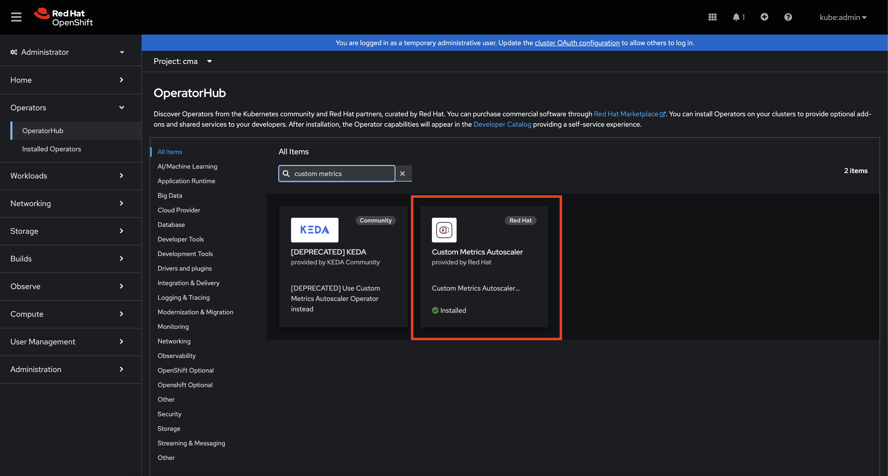
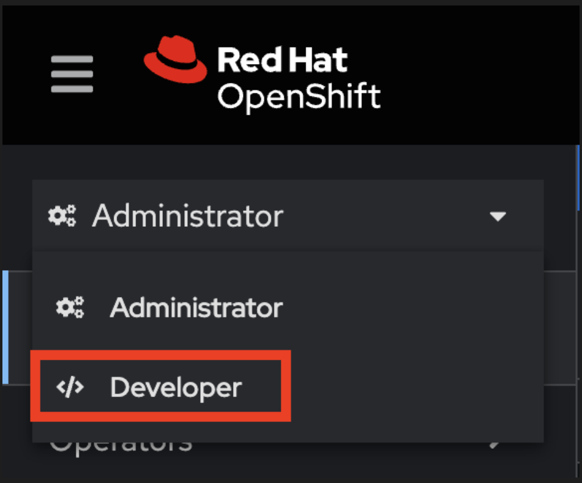
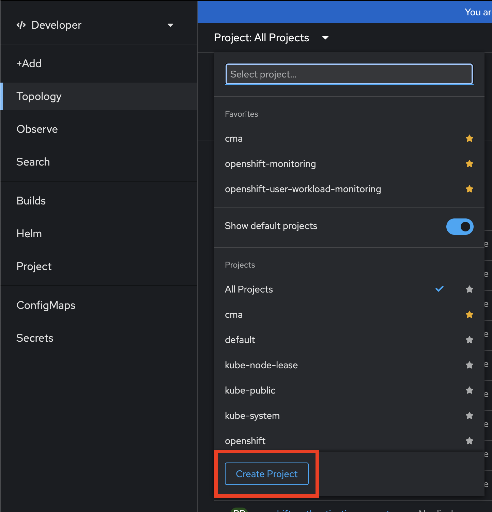
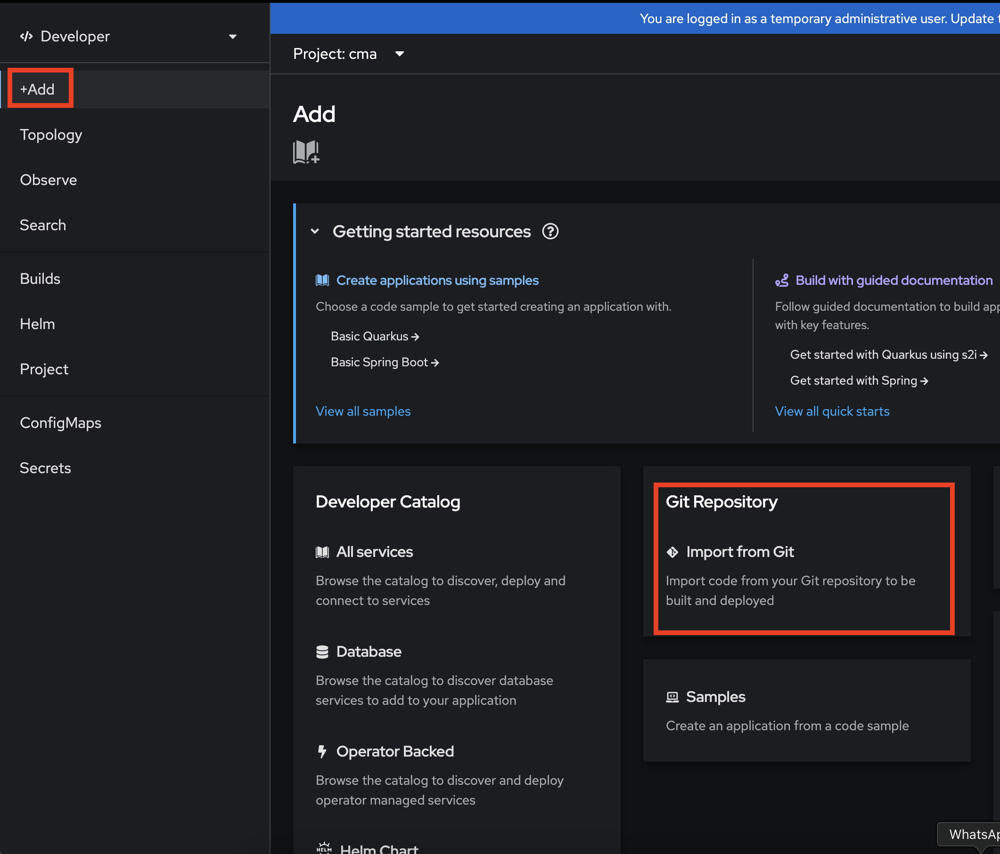
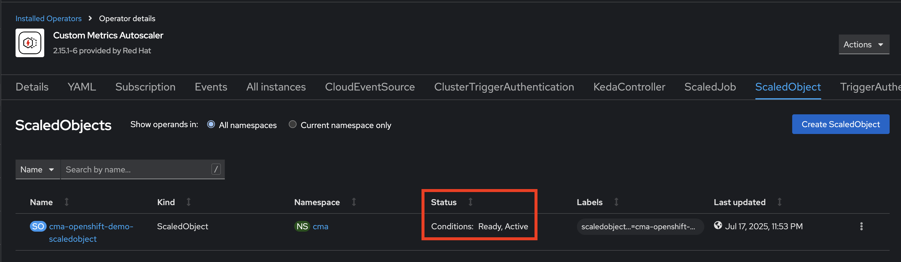
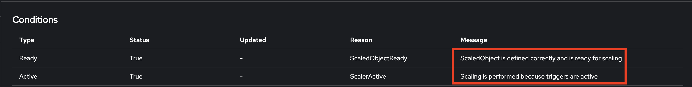

# Custom Metrics Autoscaler (CMA) on OpenShift 4.14+
This guide walks you through configuring the Custom Metrics Autoscaler (CMA) using KEDA and Prometheus on OpenShift 4.16, from enabling user workload monitoring to validating a fully functional `ScaledObject`.

---

## 1. Prerequisites

- OpenShift Container Platform 4.14+
- CMA Operator installed (namespace `openshift-keda`):


- Spring Boot application exposing `/actuator/prometheus`

---

## 2. Enable User Workload Monitoring

> **Note**: Some clusters may not include the `cluster-monitoring-config` ConfigMap by default. You can create or update it via a YAML manifest:

1. Create a file `cluster-monitoring-config.yaml` with:
   ```yaml
   apiVersion: v1
   kind: ConfigMap
   metadata:
     name: cluster-monitoring-config
     namespace: openshift-monitoring
   data:
     config.yaml: |
       enableUserWorkload: true
   ```
2. Apply the manifest:
   ```bash
   oc apply -f cluster-monitoring-config.yaml
   ```
3. Wait for the Prometheus pods to reload and pick up the new setting (check if the prometheus pods were created within the `openshift-user-workload-monitoring` namespace).

## 3. Deploy the Demo Application on OpenShift

1. Switch to developer perspective:



2. Create the `cma` project



3. Click `+Add` and choose from git strategy



4. Add the git URL (https://github.com/LeandroJan/cma-openshift-demo) and check if the chosen project is `cma`, name the application `cma-openshift-demo` and the click `Create`

5. **Verify** that the Deployment, Service, and Route are up:

   ```bash
   oc get deploy,svc,route -l app=cma-openshift-demo -n cma
   ```

6. **Retrieve the application URL**:

   ```bash
   oc get route cma-openshift-demo -n cma -o jsonpath='{.spec.host}'
   ```

7. **Test** the endpoint in your browser or with `curl`:

   ```bash
   # Capture the route host into a normal shell variable:
   ROUTE_HOST=$(oc get route cma-openshift-demo -n cma -o jsonpath='{.spec.host}')

   # Then curl, quoting the URL to avoid any parsing issues:
   curl -k "https://${ROUTE_HOST}/api/products"
   ```

---

## 4. Verify Deployment and Service

Ensure you have both:

```bash
oc get deployment cma-openshift-demo -n cma
oc get service    cma-openshift-demo -n cma
```

The Service selector should match `app: cma-openshift-demo` on port 8080.

---

## 5. Create a ServiceMonitor

```yaml
# servicemonitor-demo-app.yaml
apiVersion: monitoring.coreos.com/v1
kind: ServiceMonitor
metadata:
  name: cma-openshift-demo-servicemonitor
  namespace: cma
  labels:
    release: prometheus  # must match your Prometheus Operator label
spec:
  selector:
    matchLabels:
      app: cma-openshift-demo
  namespaceSelector:
    matchNames:
      - cma
  endpoints:
    - port: 8080-tcp # Must match the port name of the app (cma-openshift-demo)
      path: /actuator/prometheus
      interval: 15s
```

```bash
oc apply -f servicemonitor.yaml
```

---

## 6. Create ServiceAccount and Token Secret

```yaml
# serviceaccount.yaml
apiVersion: v1
kind: ServiceAccount
metadata:
  name: cma-prom-sa
  namespace: cma
```

```bash
oc apply -f serviceaccount.yaml
```

```yaml
# secret-cma-prom-sa-token.yaml
apiVersion: v1
kind: Secret
metadata:
  name: cma-prom-sa-token
  namespace: cma
  annotations:
    kubernetes.io/service-account.name: cma-prom-sa
type: kubernetes.io/service-account-token
```

```bash
oc apply -f secret-cma-prom-sa-token.yaml
```

(wait until `data.token` and `data.ca.crt` appear in the Secret)

---

## 7. Grant RBAC Permissions

### 7.1. Allow access to cluster monitoring

```bash
oc adm policy add-cluster-role-to-user cluster-monitoring-view \
  -z cma-prom-sa -n cma
```

### 7.2. Allow reading core resources in the `cma` namespace

```bash
oc adm policy add-role-to-user view \
  -z cma-prom-sa -n cma
```

---

## 8. Create TriggerAuthentication (KEDA)

```yaml
# triggerauth-cma-prom.yaml
apiVersion: keda.sh/v1alpha1
kind: TriggerAuthentication
metadata:
  name: cma-prom-trigger-auth
  namespace: cma
spec:
  secretTargetRef:
    - parameter: bearerToken
      name: cma-prom-sa-token
      key: token
    - parameter: ca
      name: cma-prom-sa-token
      key: ca.crt
```

```bash
oc apply -f trigger-auth.yaml
```

---

## 9. Create KedaController (CMA Operator)

*If not already created by the Operator installation*:

```yaml
# keda-controller.yaml
apiVersion: keda.sh/v1alpha1
kind: KedaController
metadata:
  name: keda
  namespace: openshift-keda
spec:
  watchNamespace: ""  # watch all namespaces
  operator:
    logLevel: info
    logEncoder: console
  metricsServer:
    logLevel: "0"
```

```bash
oc apply -f keda-controller.yaml
```

---

## 10. Create the ScaledObject

```yaml
# scaledobject-cma.yaml
apiVersion: keda.sh/v1alpha1
kind: ScaledObject
metadata:
  name: cma-openshift-demo-scaledobject
  namespace: cma
spec:
  scaleTargetRef:
    kind: Deployment
    name: cma-openshift-demo
  minReplicaCount: 1
  maxReplicaCount: 10
  pollingInterval: 30
  cooldownPeriod: 300
  triggers:
    - type: prometheus
      metadata:
        serverAddress: "https://thanos-querier.openshift-monitoring.svc.cluster.local:9092"
        namespace: "cma"
        metricName: "total_req_per_sec"
        query: 'sum(rate(http_server_requests_seconds_count{application="demo-app"}[1m]))'
        threshold: "50"
        authModes: "bearer"
      authenticationRef:
        name: cma-prom-trigger-auth
```

```bash
oc apply -f scaledobject.yaml
```

**Restart** the operator to force reconciliation, if necessary:

```bash
oc rollout restart deployment/keda-operator -n openshift-keda
```

---

## 11. Verify the ScaledObject

```bash
oc describe scaledobject cma-openshift-demo-scaledobject -n cma
oc get hpa keda-hpa-cma-openshift-demo-scaledobject -n cma
```
If everything is ok, you should see **Ready: True** and the HPA managing replicas based on traffic.

You can check also by de console of openshift, the condition of ScaleObject CR will be Ready and active:



And within ScaleObjects details:



---

## 12. Load Testing

Use k6 or hey to generate >50 req/s:

```bash
echo 'import http from "k6/http"; export let options={scenarios:{rps:{executor:"constant-arrival-rate",rate:50,timeUnit:"1s",duration:"2m",preAllocatedVUs:10,maxVUs:50}},insecureSkipTLSVerify:true}; export default()=>{http.get("https://<your-route>/api/products");};' > loadtest.js

k6 run loadtest.js

watch oc get hpa keda-hpa-cma-openshift-demo-scaledobject -n cma
oc get pods -l app=cma-openshift-demo -n cma
```

---

## 13. Observations

- The Prometheus trigger in KEDA expects a **single numeric result**; aggregate with `sum()` or `avg()` to produce one scalar.
- Proper RBAC roles (`cluster-monitoring-view` and `view`) are critical for the ServiceAccount token to work.

## 14. Aditional Resources

- [Configuring User Workload Monitoring](https://docs.redhat.com/en/documentation/openshift_container_platform/4.16/html/monitoring/configuring-user-workload-monitoring#configuring-metrics-uwm)
- [Installing the custom metrics autoscaler ](https://docs.redhat.com/en/documentation/openshift_container_platform/4.16/html/nodes/automatically-scaling-pods-with-the-custom-metrics-autoscaler-operator#nodes-cma-autoscaling-custom-install)
---


